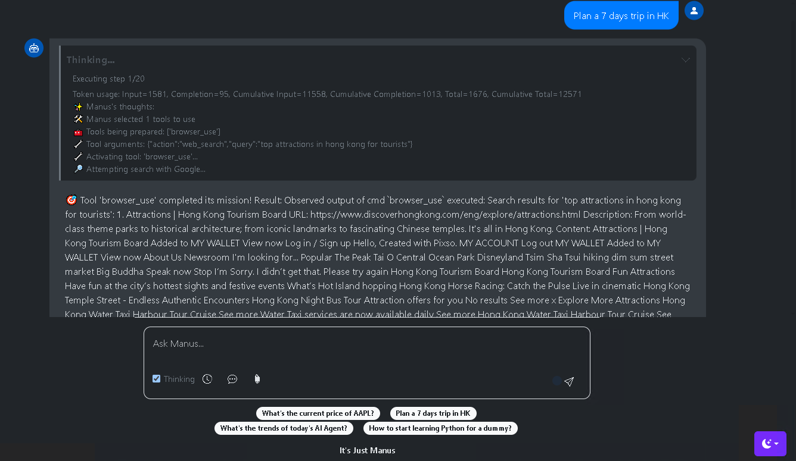

# OpenManus-UI

Welcome to OpenManus-UI, a modern and responsive Web UI built to support [OpenManus](https://github.com/FoundationAgents/OpenManus). Developed using Bootstrap and pure JavaScript with Server-Sent Events (SSE), OpenManus-UI provides an intuitive interface for users to interact with the OpenManus platform.

## Overview

OpenManus-UI is an open-source project designed to enhance the functionality of [OpenManus](https://github.com/FoundationAgents/OpenManus) by offering a sleek, user-friendly web interface. It supports features like history chat data reload and boasts a contemporary layout design, making it easy for developers and end-users alike to navigate and utilize.

## Features

- **Responsive Design**: Built with Bootstrap for a mobile-first approach and compatibility across all device sizes.
- **Real-time Updates**: Utilizes Server-Sent Events (SSE) for real-time data streaming and updates.
- **Chat History**: Supports reloading and viewing chat history data seamlessly.
- **Modern Layout**: Clean, intuitive, and modern UI design to enhance user experience.
- **Pure JavaScript**: Lightweight and fast, with no heavy dependencies other than Bootstrap.

<div align="center" style="display: flex; gap: 20px;">
    
</div>

## Installation

1. Clone the repository to your local machine:

   ```bash
   git clone https://github.com/aliasmaya/openmanus-ui.git
   ```

2. Copy "static", "templates" and "app.py" to your OpenManus project

## Usage

To start the OpenManus-UI, run the following command in your OpenManus project:

```bash
python app.py
```

Open your web browser and navigate to `http://localhost:5172` (or the port specified in your configuration). You should see the OpenManus-UI interface, ready to interact with the OpenManus backend.

## License

This project is licensed under the MIT License - see the [LICENSE](LICENSE) file for details.

## Acknowledgments

- Appreciation to the [OpenManus](https://github.com/FoundationAgents/OpenManus) and community for their support and collaboration.
